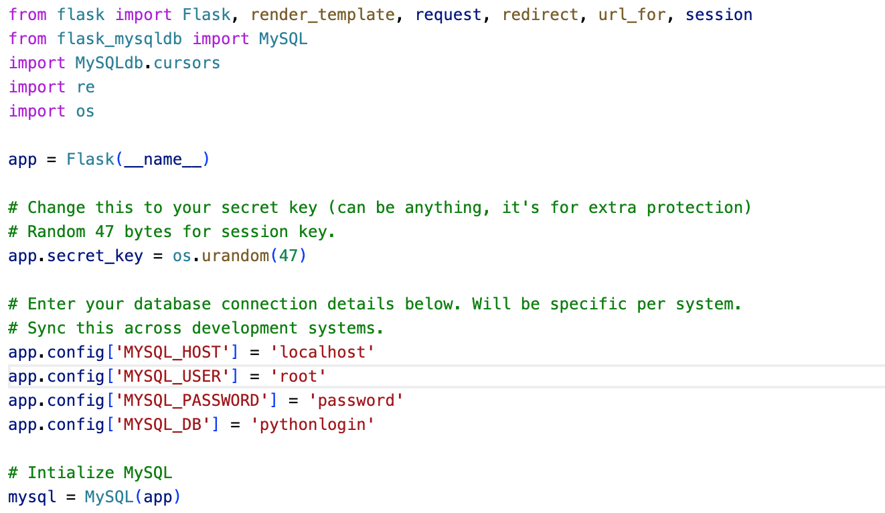
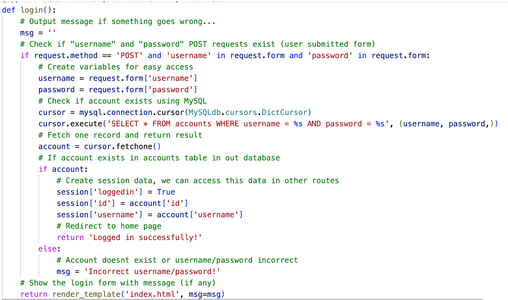

This instruction manual describes how to create a login application using the Flask web framework and MySQL database. The application allows users to login with a username and password, and it uses session data to track whether a user is logged in.

1. Install Flask and Flask-MySQLdb

Before we start, make sure you have Flask and Flask-MySQLdb installed in your Python environment. You can install them using pip:

pip install Flask Flask-MySQLdb

2. Set up the Database (inital database)
Create a MySQL database called "pythonlogin" and a table called "accounts". The "accounts" table should have three columns: "id", "username", and "password".

3. Set up the Flask Application
Create a new Python file and import the necessary modules. Then create a Flask application and set its secret key

In Flask, the secret key is used to secure cookies and the session information. When a user logs in, a session is created on the server-side and a cookie with a session ID is sent to the user's browser. The secret key is used to sign the session cookie to prevent tampering by an attacker.

If an attacker manages to modify the session cookie, they could potentially gain access to the user's session, allowing them to perform actions on behalf of the user. By using a secret key to sign the cookie, Flask ensures that the cookie can't be tampered with, and the user's session remains secure.

Additionally, the secret key is also used for other security-related features in Flask, such as securely storing user passwords or generating random tokens.

4. Create the Login Route

Define a route for the login page, which will handle both GET and POST requests. In the POST request handler, check if the "username" and "password" fields exist in the submitted form. Then, query the database to check if the user exists and the password is correct. If so, set session data to indicate that the user is logged in and redirect to the home page. If not, display an error message.

5. Create Registeration

The code defines a route '/pythonlogin/register' and maps it to the function 'register()'. When a user navigates to this route using a web browser, the function checks if the request is a GET or POST request.

If the request is a POST request and the form has fields for 'username', 'password', and 'email', the function creates variables for these fields and performs a series of validation checks on them. It checks if the account already exists in a MySQL database by executing a SELECT query, and shows an error message if it does. It also checks if the username contains only characters and numbers, and if the email and phone number are in valid formats. Finally, it checks if any of the fields are empty, and if not, it inserts the new account information into the MySQL database.

If the request is a POST request but the form does not contain the required fields, the function shows an error message asking the user to fill out the form.

If the request is a GET request or there is no form data in the POST request, the function displays the registration page along with any error messages generated during validation.

6. Home page

This code defines a Flask route for the home page of a social media application. The route is set to /socials/home and it only allows access to users who are currently logged in.

The route function home() first checks if the loggedin key is present in the session object. If it is, the function renders the home.html template, passing the username of the logged in user to the template. If the loggedin key is not present in the session object, the user is redirected to the login page using the redirect() method and url_for() function.

To use this code, you need to have a home.html template file and a login system in place, which sets the loggedin key in the session object when a user successfully logs in. You would also need to make sure that the route to the login page is correctly defined, so that the user can be redirected to it if they are not logged in.

7. Profile Page

This is a Python Flask route for handling requests to display the user profile page. It is mapped to the /socials/profile URL.

First, it checks if the user is logged in by checking if the loggedin key is present in the session dictionary. If the user is not logged in, the function redirects the user to the login page.

If the user is logged in, the function retrieves the user's account information from the database using the user's id stored in the session dictionary. It uses the MySQLdb.cursors.DictCursor cursor class to get the account information as a dictionary.

Then, it passes the account dictionary to the profile.html template and renders the template using the render_template() function. The account dictionary is used to display the user's account information on the profile page.

8. Clear session on logout

This code defines a route for the /socials/logout URL. When a user accesses this page, the session data for that user is removed using the session.pop() method. This includes the loggedin flag, the user id, and the username. This effectively logs the user out by destroying their session data. Finally, the user is redirected to the login page using the redirect() method and the url_for() function.

