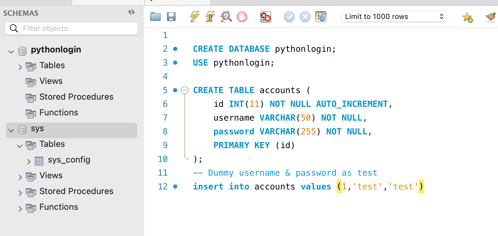

This instruction manual describes how to create a login application using the Flask web framework and MySQL database. The application allows users to login with a username and password, and it uses session data to track whether a user is logged in.

1. Install Flask and Flask-MySQLdb
Before we start, make sure you have Flask and Flask-MySQLdb installed in your Python environment. You can install them using pip:

pip install Flask Flask-MySQLdb

2. Set up the Database (inital database)
Create a MySQL database called "pythonlogin" and a table called "accounts". The "accounts" table should have three columns: "id", "username", and "password".

3. Set up the Flask Application
Create a new Python file and import the necessary modules. Then create a Flask application and set its secret key

